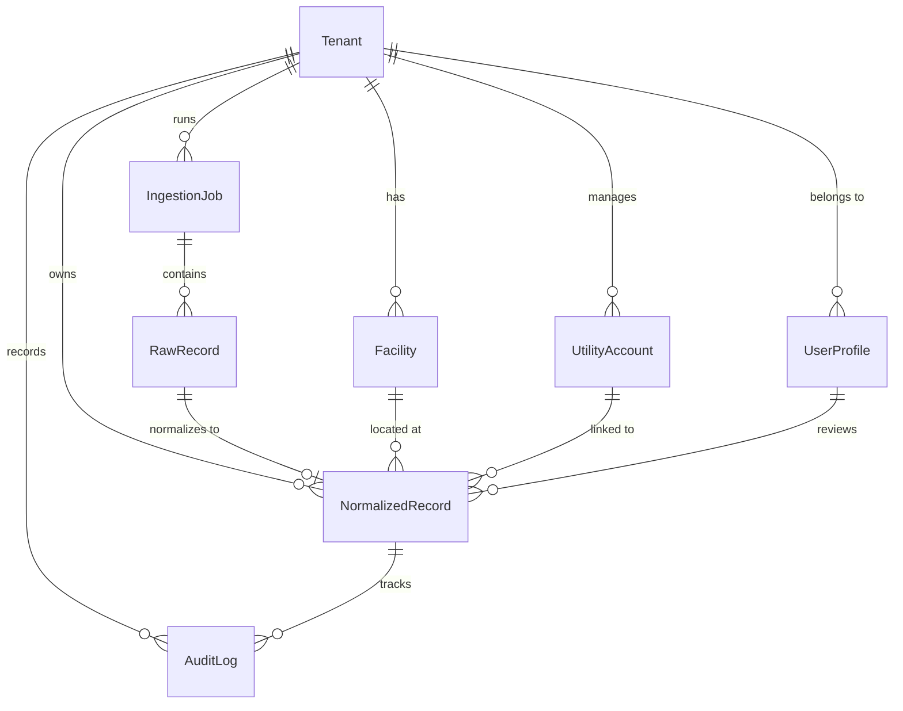

# Data Model (MODEL.md)

This document details the database schema and model architecture designed for the Breathe ESG platform. It explains how we handle multi-tenancy, Scope 1/2/3 categorization, source-of-truth tracking, unit normalization, and the creation of an immutable audit trail.

---

## 1. Schema Diagram

The relationship between the models is structured as follows:

---

## 2. Core Models Specification

### 2.1 Tenant (Multi-Tenancy)
Tracks the organizational unit. All data belongs to a specific tenant.
- `id` (UUID, PK): Globally unique identifier.
- `name` (CharField): Name of the client company.
- `hq_country` (CharField, ISO 2-letter): Base country for the tenant, used for default values (e.g., when hotel country is unspecified).
- `created_at` (DateTimeField): Timestamp when the tenant was provisioned.

*Rationale*: Multi-tenancy is enforced at the database query level by filtering all endpoints and queries by the logged-in user's `tenant_id`. No cross-tenant data leaks are possible.

### 2.2 UserProfile (Authentication & Access Control)
Extends the standard Django auth user.
- `id` (UUID, PK)
- `user` (OneToOneField to django.contrib.auth.models.User): Link to Django's standard auth system.
- `tenant` (ForeignKey to Tenant): The organization the user belongs to.
- `role` (CharField): `ANALYST`, `AUDITOR`, or `ADMIN`.

*Rationale*: Analysts edit, upload, and approve data. Auditors can read and export the data but cannot modify or approve it. Admins manage mappings.

### 2.3 Facility (Spatial Hierarchy)
Represents physical locations (offices, plants, warehouses) operated by a tenant.
- `id` (UUID, PK)
- `tenant` (ForeignKey to Tenant)
- `name` (CharField)
- `plant_code` (CharField): SAP plant code (e.g., `1000`, `DE01`) used for automated SAP data mapping.
- `country` (CharField, ISO 2-letter)
- `region` (CharField): Grid subregion or province (e.g., US eGRID regions like `CAMX` or `NYUP`) to look up Scope 2 electricity grid intensity factors.

*Rationale*: Standardizing location codes via a mapping table is essential because raw SAP files only contain codes like `WERKS = "1200"`. A lookup links them to real places with regional grid intensities.

### 2.4 UtilityAccount
- `id` (UUID, PK)
- `tenant` (ForeignKey to Tenant)
- `facility` (ForeignKey to Facility): Facility associated with this meter.
- `account_number` (CharField)
- `meter_number` (CharField): The physical meter number, used to identify billing periods and check for overlaps.
- `provider_name` (CharField): Utility provider (e.g., PG&E, National Grid).

*Rationale*: Maps portal CSV uploads that contain only account numbers or meter IDs directly to a physical facility.

### 2.5 Airport (Travel Distance Base)
An immutable table containing coordinates of global airports.
- `iata_code` (CharField, 3 chars, PK): e.g., `JFK`, `LAX`, `LHR`.
- `name` (CharField)
- `city` (CharField)
- `country` (CharField, ISO 2-letter)
- `latitude` (DecimalField, 9 decimal places): Geographic latitude.
- `longitude` (DecimalField, 9 decimal places): Geographic longitude.

*Rationale*: Travel platform exports often lack flight distances, containing only airport codes. The backend uses airport GPS coordinates to compute Great Circle Distance (Haversine formula), which is more accurate than arbitrary distance mocks.

### 2.6 EmissionFactor (Environmental Reference)
The lookup table mapping activity data to carbon equivalents.
- `id` (UUID, PK)
- `scope` (IntegerField): `1` (Direct), `2` (Indirect Energy), or `3` (Other Indirect).
- `category` (CharField): `FUEL`, `ELECTRICITY`, `FLIGHT`, `HOTEL`, `GROUND_TRANSPORT`.
- `activity_type` (CharField): Specific type (e.g., `DIESEL`, `NATURAL_GAS`, `GRID_ELECTRICITY`, `FLIGHT_SHORT_HAUL`, `HOTEL_NIGHT`).
- `region` (CharField): Grid subregion or country (e.g., `US-CA`, `IN`, `DE`, `GLOBAL`).
- `factor` (DecimalField, 6 decimal places): Carbon emission factor in **kg CO2e** per unit.
- `unit` (CharField): The unit this factor applies to (e.g., `L`, `kWh`, `pkm` [passenger-kilometer], `room_night`).
- `source_citation` (CharField): Citation of the factor source (e.g., `DEFRA 2024`, `EPA eGRID 2023`).

*Rationale*: Separating emission factors into a configuration database makes it easy to update factors annually without changing python code.

### 2.7 IngestionJob (Ingestion Metadata)
Logs the status of file uploads or API pulls.
- `id` (UUID, PK)
- `tenant` (ForeignKey to Tenant)
- `source_type` (CharField): `SAP_FUEL_PROCUREMENT`, `UTILITY_PORTAL_CSV`, `CONCUR_TRAVEL`.
- `file_name` (CharField): Name of the ingested file.
- `status` (CharField): `PENDING`, `PROCESSING`, `COMPLETED`, `FAILED`.
- `error_summary` (TextField, Nullable): Summary of file-level failures (e.g., CSV formatting error).
- `uploaded_by` (ForeignKey to UserProfile)
- `uploaded_at` (DateTimeField): Ingestion timestamp.

### 2.8 RawRecord (Source-of-Truth Tracking)
Stores the raw, unnormalized data exactly as it was received.
- `id` (UUID, PK)
- `job` (ForeignKey to IngestionJob)
- `row_index` (IntegerField): Index of the line in the uploaded file, allowing analysts to cross-reference with the original document.
- `raw_data` (JSONField): The complete raw data row saved as a JSON object (immutable).
- `status` (CharField): `SUCCESS` (normalized), `FAILED` (parsing/validation error), `SKIPPED` (valid but non-emissions data, e.g., procurement of office chairs).
- `error_message` (TextField, Nullable): Specific parsing failure message.

*Rationale*: By preserving the raw data in a `JSONField`, we maintain an unalterable, permanent record of the source-of-truth. Auditors can verify the integrity of the ingestion process by comparing raw values side-by-side with normalized values.

### 2.9 NormalizedRecord (The ESG Ledger)
The main ledger of activity data, containing normalized values and calculated emissions.
- `id` (UUID, PK)
- `tenant` (ForeignKey to Tenant)
- `raw_record` (OneToOneField to RawRecord): Link to the original raw record.
- `facility` (ForeignKey to Facility, Nullable): Physical facility this emission is attributed to.
- `scope` (IntegerField): `1`, `2`, or `3`.
- `category` (CharField): e.g., `FUEL`, `ELECTRICITY`, `FLIGHT`, `HOTEL`.
- `activity_type` (CharField): e.g., `DIESEL`, `GRID_ELECTRICITY`, `FLIGHT_LONG_HAUL`.
- `start_date` (DateField): Start of activity period.
- `end_date` (DateField): End of activity period.
- `raw_quantity` (DecimalField, 4 decimal places): Original quantity.
- `raw_unit` (CharField): Original unit.
- `normalized_quantity` (DecimalField, 4 decimal places): Quantity in normalized unit.
- `normalized_unit` (CharField): Normalized unit (e.g., `L`, `kWh`, `pkm`, `room_night`).
- `carbon_emissions_mtco2e` (DecimalField, 6 decimal places): Calculated emissions in Metric Tons of CO2 equivalent ($MT CO_2e$).
- `status` (CharField): `PENDING` (needs review), `APPROVED` (locked for audit), `REJECTED`.
- `is_edited` (BooleanField): Flag indicating if an analyst modified this record.
- `rejection_reason` (TextField, Nullable): Rejection details.
- `reviewed_by` (ForeignKey to UserProfile, Nullable): Analyst who signed off.
- `reviewed_at` (DateTimeField, Nullable): Timestamp of sign-off.

*Rationale*:
1. **DecimalField Usage**: We use `DecimalField` instead of `FloatField` for all quantities, emission factors, and calculations. Floating-point types introduce rounding inaccuracies (e.g., `0.1 + 0.2 = 0.30000000000000004`), which are unacceptable in auditing contexts.
2. **Dates**: We store both `start_date` and `end_date` to support calendar-month proration and billing periods. For travel, these dates might represent the trip segment date.

### 2.10 AuditLog (Auditing & Trail)
An immutable ledger tracking every modification to the `NormalizedRecord` table.
- `id` (UUID, PK)
- `tenant` (ForeignKey to Tenant)
- `normalized_record` (ForeignKey to NormalizedRecord)
- `action` (CharField): `CREATE`, `UPDATE`, `APPROVE`, `REJECT`.
- `field_name` (CharField, Nullable): Name of the field changed (e.g., `normalized_quantity`, `status`).
- `old_value` (TextField, Nullable): Previous value.
- `new_value` (TextField, Nullable): New value.
- `changed_by` (ForeignKey to UserProfile): User who performed the action.
- `changed_at` (DateTimeField): Timestamp of the change.

---

## 3. Addressing Audit and Regulatory Compliance

This data model is designed to support carbon accounting audits under standard frameworks like the GHG Protocol:
1. **Lineage (Raw to Normalized)**: There is a direct `OneToOneField` link from the normalized row back to the `RawRecord`. The original uploaded payload is preserved in `raw_data` and is read-only.
2. **Audit Trails**: Every edit made by an analyst creates an `AuditLog` row documenting the exact field modified, the before/after values, the user's name, and the timestamp. When a record is `APPROVED` or `REJECTED`, that transaction is also written to the audit log.
3. **Locking**: Once a record is marked as `APPROVED`, the backend blocks any further edits (makes it read-only) unless it is explicit unlocked by an administrator, which would generate an administrative audit log.
4. **Calculations Transparancy**: The backend stores the exact emission factor used (`EmissionFactor` link or values) and the formula inputs so that auditors can reconstruct the calculation.
