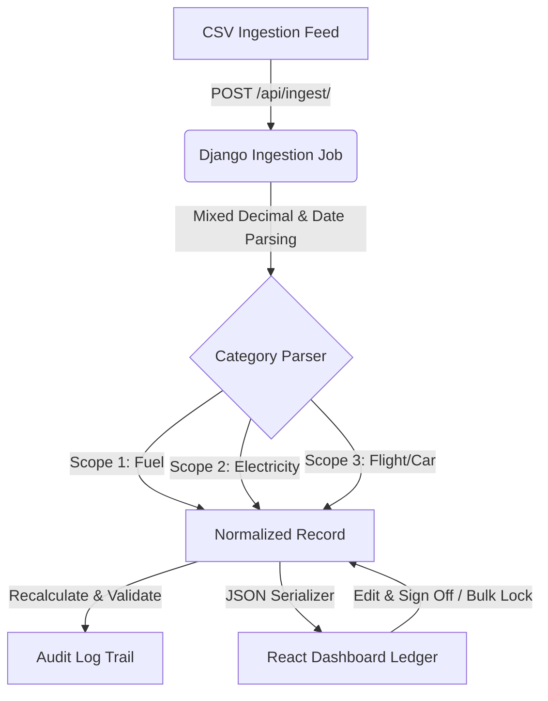

# Breathe ESG Ingestion Engine & Review Ledger

A modern, enterprise-grade ESG Carbon Management dashboard prototype built using **Django REST Framework** (Python) and **React (Vite + TypeScript)**. It integrates automated multi-scope ingestion, data proration, inline recalculations, audit lineage validation, and multi-tenant security isolation.

Live Production URL: **[https://esg-dashboard-ap1y.onrender.com](https://esg-dashboard-ap1y.onrender.com)**

---

## ⚡ Key Features

- 📊 **Liquid-Glassmorphic UI**: Premium high-contrast frosted glass panels with hardware-accelerated animations (staggered cards, transitions, and warning pulses) for both Light and Dark modes.
- 📥 **Automated Multi-Scope Ingestion Engine**:
  - **SAP Fuel Procurement (Scope 1)**: Filters fuel logs (Diesel, Gasoline, Natural Gas) from general material sheets, with decimal parser support for both German (`1.250,50`) and US (`1,500.00`) formatting.
  - **Utility Electricity Portals (Scope 2)**: Prorates billing periods across months and automatically alerts users of overlapping cycles.
  - **Corporate Travel Expenses (Scope 3)**: Calculates flight distances via Great Circle Haversine formulas with business/first multipliers, and estimates car transport using rental days when distance is missing.
- 🔍 **Calculations & Lineage Verification**:
  - Slide-over drawer detailing raw uploaded JSON records.
  - Contextual math lineage cards demonstrating exact values (e.g. `(6,200 * 0.2310) / 1000 = 1.4322 MT`) instead of generic formulas.
  - Tailored lineage parameters for **Scope 1 Fuel**, **Scope 2 Electricity**, **Scope 3 Flight**, and **Scope 3 Ground Transport**.
- 🛠️ **Recalculations & Audit Locking**:
  - Dynamic recalculation on manual quantity changes.
  - Immutable audit logs showing original vs updated quantities.
  - Automatic database row-locking once marked as `APPROVED` to prevent modification.
- 🔒 **Multi-Tenant Security Isolation**: Dynamically filters database views and statistics, separating Acme Corporation and EcoSphere Industries.

---

## 🏗️ Technical Architecture



---

## 🚀 Local Development Setup

### 1. Backend Setup (Django)

1. Navigate to the backend directory:
   ```bash
   cd backend
   ```
2. Create and activate a Python virtual environment:
   ```bash
   # Windows (PowerShell/CMD)
   python -m venv venv
   .\venv\Scripts\activate

   # macOS/Linux
   python3 -m venv venv
   source venv/bin/activate
   ```
3. Install dependencies:
   ```bash
   pip install -r requirements.txt
   ```
4. Run migrations and seed database references:
   ```bash
   python manage.py migrate
   python seed_db.py
   ```
5. Start the development server:
   ```bash
   python manage.py runserver
   ```
   The backend API runs at `http://127.0.0.1:8000/`.

### 2. Frontend Setup (React + Vite + TS)

1. Navigate to the frontend directory:
   ```bash
   cd frontend
   ```
2. Install npm packages:
   ```bash
   npm install
   ```
3. Start the dev server:
   ```bash
   npm run dev
   ```
   The React frontend runs at `http://localhost:5173/` (proxies `/api` requests to port 8000).

---

## 🧪 Testing Suite

### 1. Backend Calculations & Calculations Tests
Runs Django assertions on Haversine distance, proration algorithms, thousands-separator parsing, and security isolation:
```bash
cd backend
python manage.py test
```

### 2. Frontend E2E Playwright Browser Tests
Performs a fully automated browser simulation (headful local run) uploading feeds, validating recalculation modals, bulk approvals, audit trails, and multi-tenant separation:
```bash
cd frontend
node test_e2e_browser.cjs
```

### 3. Production Live API Tests
Runs headless playwright verification targeting the live deployed cloud app:
```bash
cd frontend
node test_production.cjs
```

---

## 👥 Mock Accounts & Roles

Use the navbar session dropdown switcher to switch roles and organizations:

| Mock Username | Organization (Tenant) | Role | Permissions |
| :--- | :--- | :--- | :--- |
| **`acme_analyst`** | Acme Corporation | **Analyst** | Upload feeds, edit quantities, recalculate, and bulk sign-off |
| **`acme_auditor`** | Acme Corporation | **Auditor** | Read-only access to Acme data, cannot edit or sign off |
| **`eco_analyst`** | EcoSphere Industries | **Analyst** | Ingest feeds and manage EcoSphere scope metrics |
| **`eco_auditor`** | EcoSphere Industries | **Auditor** | Read-only access to EcoSphere metrics |

---

## ☁️ Cloud Deployment Configuration

The repository includes a multi-stage production `Dockerfile` in the root directory, deployed directly to **Render**.

### Deployed to Render
1. Linked to this GitHub repository.
2. Configured to use the **Docker** runtime environment.
3. Automatically runs migrations and database seeding scripts (`seed_db.py`) on container startup.
